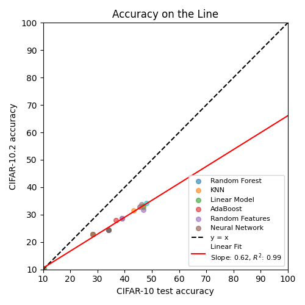

# Accuracy on the Line

This repository reproduces results for the paper ["Accuracy on the Line"](https://proceedings.mlr.press/v139/miller21b/miller21b.pdf) using CIFAR-10 and CIFAR-10.2 datasets. It provides scripts for data preparation, model training, and experiment evaluation.

## Description
In this project, models are trained on the CIFAR-10 training set and evaluated on both the CIFAR-10 test set and the CIFAR-10.2 test set. By comparing results across these datasets, we analyze the correlation between accuracy on the original test set and accuracy on a new, closely related dataset. This helps to understand how well test accuracy predicts performance on similar, but unseen, data.



## Table of Contents
- [Accuracy on the Line](#accuracy-on-the-line)
  - [Description](#description)
  - [Table of Contents](#table-of-contents)
  - [Installation](#installation)
  - [Data Setup](#data-setup)
    - [Data Download](#data-download)
  - [Project Structure](#project-structure)
  - [Running Experiments](#running-experiments)
  - [Plotting Results](#plotting-results)
  - [Results](#results)
  - [Citation](#citation)

---

## Installation

1. **Clone the repository:**
   ```bash
   git clone <repo-url>
   cd Accuracy-on-the-line
   ```

2. **Install dependencies:**
   ```bash
   pip install -r requirements.txt
   ```

## Data Setup

- Create data folder manually before running:
  ```bash
  mkdir -p data/raw
  ```
### Data Download

- **CIFAR-10:** Downloaded automatically by scripts.
- **CIFAR-10.2:** Download manually from [CIFAR-10.2 GitHub](https://github.com/modestyachts/cifar-10.2).
  - Place `cifar102_test.npz` in `data/raw/`.


## Project Structure

- `src/`: Main code (data loading, experiments)
- `models/`: Model definitions and outputs
- `data/`: Data storage
- `reports/`: Figures and results

## Running Experiments

To reproduce results:

```bash
python src/run_experiment.py
```

This will:
- Train multiple models (Random Forest, KNN, Logistic Regression, AdaBoost, Random Features, MLP)
- Evaluate on CIFAR-10 and CIFAR-10.2
- Save results to `models/outputs/experiment_results.json`

## Plotting Results

To visualize experiment results:

```bash
python src/plots.py
```

This will generate plots from the results in `models/outputs/experiment_results.json` and save them to the appropriate location (e.g., `reports/figures/`).

## Results

Results are saved in `models/outputs/experiment_results.json` as a list of runs with accuracy and timing for each model.

## Citation

If you use this code, please give me a star and cite the original paper.

---